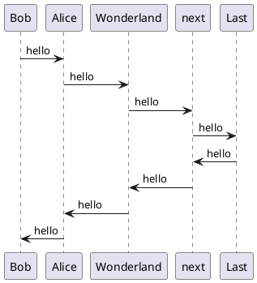

# Remark Sync PlantUML Plugin

[](LICENSE)

`remark-sync-plantuml` is a plugin for [remarkjs](https://github.com/remarkjs/remark) that converts PlantUML code blocks to image nodes.

## Installing

```bash
npm install --save remark-sync-plantuml
```

## Dependencies

Requires java to be installed on the system.

## Example

You can use this plugin like following

### Markdown

````markdown
# Your markdown including PlantUML code block


````

### JavaScript

```javascript
import rehypeKatex from 'rehype-katex';
import rehypeStringify from 'rehype-stringify';
import remarkGfm from 'remark-gfm';
import remarkMath from 'remark-math';
import remarkParse from 'remark-parse';
import remarkRehype from 'remark-rehype';
import remarkPlantuml from 'remark-sync-plantuml';
import { unified } from 'unified';

export const markdownToHtml = async (markdown: string) =>
  (
    await unified()
      .use(remarkParse)
      .use(remarkMath)
      .use(remarkGfm)
      .use(remarkPlantuml)
      .use(remarkRehype, { allowDangerousHtml: true })
      .use(rehypeKatex)
      .use(rehypeStringify, { allowDangerousHtml: true })
      .process(markdown)
  )
    .toString();

```

## Integration

You can use this plugin in any frameworks support remarkjs.

If you want to use in the classic preset of [Docusaurus 2](https://v2.docusaurus.io/), like me, set configuration in your `docusaurus.config.js` like following.

```javascript
const remarkPlantUML = require("remark-sync-plantuml");

// your configurations...

presets: [
    [
      "@docusaurus/preset-classic",
      {
        docs: {
          sidebarPath: require.resolve("./sidebars.js"),
          remarkPlugins: [remarkPlantUML]
        }
      }
    ]
  ],

//...
```
