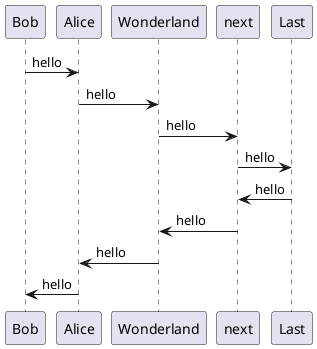

# Remark Sync PlantUML Plugin

[](LICENSE)

`remark-sync-plantuml` is a plugin for [remarkjs](https://github.com/remarkjs/remark) that converts PlantUML code blocks to image nodes.

## Installing

```bash
npm install --save remark-sync-plantuml
```

## Dependencies

Requires java to be installed on the system.

## Example

You can use this plugin like following

### Markdown

````markdown
# Your markdown including PlantUML code block


````

### JavaScript

```javascript
const remark = require("remark");
const remarkPlantUML = require("remark-sync-plantuml");
const fs = require("fs");
const path = require("path");

const input = fs.readFileSync(path.resolve(__dirname, "./your-markdown.md")).toString();
const output = remark().use(remarkPlantUML).processSync(input).toString();
```

## Integration

You can use this plugin in any frameworks support remarkjs.

If you want to use in the classic preset of [Docusaurus 2](https://v2.docusaurus.io/), like me, set configuration in your `docusaurus.config.js` like following.

```javascript
const remarkPlantUML = require("remark-sync-plantuml");

// your configurations...

presets: [
    [
      "@docusaurus/preset-classic",
      {
        docs: {
          sidebarPath: require.resolve("./sidebars.js"),
          remarkPlugins: [remarkPlantUML]
        }
      }
    ]
  ],

//...
```
